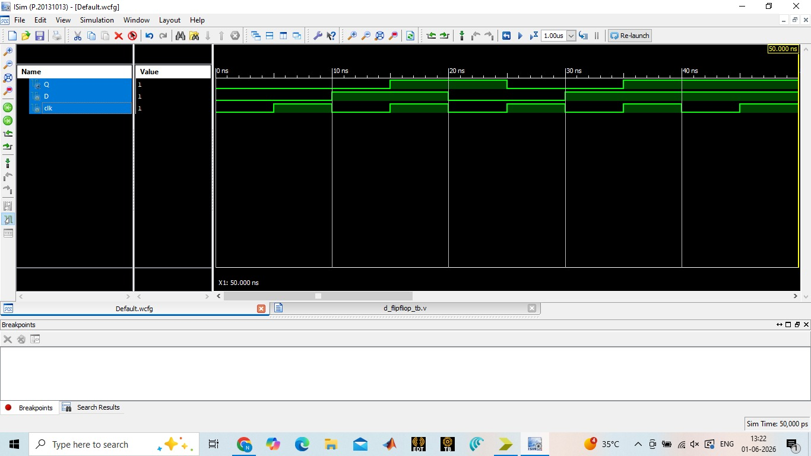

# VLSI Design Internship – Task 3

## Verilog RTL Design of Sequential Circuits and Flip-Flops

### 📌 Objective
The objective of this task is to design and simulate basic sequential circuits using Verilog HDL. Sequential circuits store information and operate based on clock signals. This task covers Flip-Flops, Registers, Counters, Testbenches, and Waveform Analysis.

---

## 🛠 Tools Used

- Verilog HDL
- EDA Playground
- Icarus Verilog
- GTKWave
- GitHub

---

# 1. D Flip-Flop

### Theory
A D Flip-Flop stores one bit of data. On every positive edge of the clock signal, the output Q follows the input D.

### Truth Table

| Clock Edge | D | Q(next) |
|------------|---|----------|
| ↑ | 0 | 0 |
| ↑ | 1 | 1 |

### Verilog Code

```verilog
module d_ff(
    input clk,
    input d,
    output reg q
);

always @(posedge clk)
begin
    q <= d;
end

endmodule
```

### Output Waveform


---

# 2. JK Flip-Flop

### Theory
JK Flip-Flop removes the invalid state of SR Flip-Flop and can hold, set, reset, or toggle the output.

### Truth Table

| J | K | Q(next) |
|---|---|----------|
| 0 | 0 | No Change |
| 0 | 1 | Reset |
| 1 | 0 | Set |
| 1 | 1 | Toggle |

### Verilog Code

```verilog
module jk_ff(
    input clk,
    input j,
    input k,
    output reg q
);

always @(posedge clk)
begin
    case({j,k})
        2'b00: q <= q;
        2'b01: q <= 0;
        2'b10: q <= 1;
        2'b11: q <= ~q;
    endcase
end

endmodule
```

### Output Waveform


---

# 3. 4-Bit Register

### Theory
A register is a collection of flip-flops used to store multiple bits of data.

### Truth Table

| Clock Edge | Input D[3:0] | Output Q[3:0] |
|------------|-------------|---------------|
| ↑ | Data Input | Stored Data |

### Verilog Code

```verilog
module register4(
    input clk,
    input [3:0] d,
    output reg [3:0] q
);

always @(posedge clk)
begin
    q <= d;
end

endmodule
```

### Output Waveform


---

# 4. 4-Bit Up Counter

### Theory
A counter changes its state on every clock pulse. A 4-bit up counter counts from 0000 to 1111.

### Count Sequence

| Clock Pulse | Count |
|------------|--------|
| 0 | 0000 |
| 1 | 0001 |
| 2 | 0010 |
| 3 | 0011 |
| 4 | 0100 |
| ... | ... |
| 15 | 1111 |

### Verilog Code

```verilog
module up_counter(
    input clk,
    output reg [3:0] count
);

initial
begin
    count = 4'b0000;
end

always @(posedge clk)
begin
    count <= count + 1;
end

endmodule
```

### Output Waveform


---

# Testbench Verification

Each sequential circuit was verified using a dedicated Verilog testbench. Clock signals and input patterns were generated to validate circuit functionality.

### Verification Steps

1. Write RTL design code.
2. Create testbench module.
3. Generate clock signal.
4. Apply test inputs.
5. Run simulation.
6. Observe waveform output.
7. Verify expected behavior.

---

# Results

All circuits were successfully designed, simulated, and verified.

✅ D Flip-Flop

✅ JK Flip-Flop

✅ 4-Bit Register

✅ 4-Bit Up Counter

✅ Testbench Verification

✅ Waveform Analysis

---

# Project Structure

```text
Task3_Sequential_Circuits
│
├── D_FlipFlop.v
├── D_FlipFlop_tb.v
│
├── JK_FlipFlop.v
├── JK_FlipFlop_tb.v
│
├── Register4.v
├── Register4_tb.v
│
├── UpCounter.v
├── UpCounter_tb.v
│
├── screenshots
│   ├── dff_waveform.png
│   ├── jkff_waveform.png
│   ├── register_waveform.png
│   └── counter_waveform.png
│
└── README.md
```

---

# Conclusion

This project provided hands-on experience in designing and simulating sequential circuits using Verilog HDL. The implementation of Flip-Flops, Registers, and Counters improved understanding of clock-driven digital systems, RTL coding, and verification methodologies.

---

## Author
Aparna Marisetty
**Aparna Marisetty**

VLSI Design Internship – Task 3
